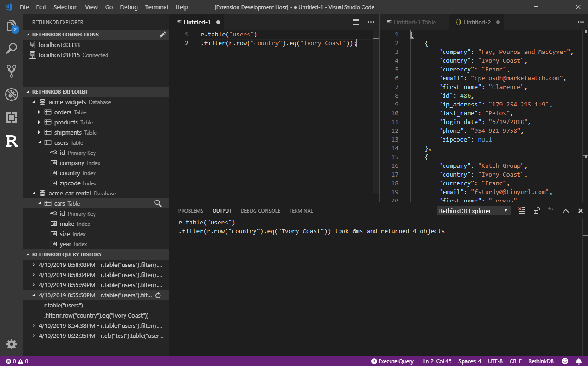

# RethinkDB Explorer

An extension to allow you to query your RethinkDB server from right inside your favorite editor. Simply switch your document type to RethinkDB and start writing your query.

## Features

- Query against your RethinkDB server and retreive results in a JSON and tabular format
- Restore a previous query and its data from a history of your most recent queries
- View your databases, tables, and indexes

## Instructions

Set your default connection settings through the settings page. Once you are connected, all you have to do is change your document type to 'RethinkDB' and the 'Execute Query' button will appear.

If you wish to add more than one connection, click on the pencil icon. This will open the settings.json file and add a template configuration.

To change connection, click on the connect icon next to the server.

## Extension Settings

This extension is configured through the following settings:

- `rethinkdbExplorer.host`: Address of the RethinkDB server to connect to. Defaults to `localhost`.
- `rethinkdbExplorer.port`: Specifies the port the RethinkDB server is listening on. Defaults to `28015`.
- `rethinkdbExplorer.database`: Default database to connect to.
- `rethinkdbExplorer.username`: Username to use when connecting to the RethinkDB server.
- `rethinkdbExplorer.password`: Password to use when connecting to the RethinkDB server.
- `rethinkdbExplorer.connectionNickname`: A human readable name for the connection.
- `rethinkdbExplorer.tls`: Connect to RethinkDB over a tls connection. Defaults to `false`.
- `rethinkdbExplorer.maxHistory`: How many previous queries to save. Defaults to `50`.
- `rethinkdbExplorer.supplementalConnections`: An array of other connections to use.

## Release Notes

### 1.0.0

Initial release

## 1.0.1

- Improved intellisense
- Added visual database viewer

## 1.0.2

- Improved database viewer
- Added more output for connection failures

## 1.0.3

- Added support for multiple servers

## 1.0.4

- Fixed issue with settings template
- Fixed issue where you could not load table schema if you were not an admin user
- Added connection nickname support

## 1.0.5

- Bug fixes

## 1.0.6

- Improved table view

## 1.0.7

- Single records now display in table view
